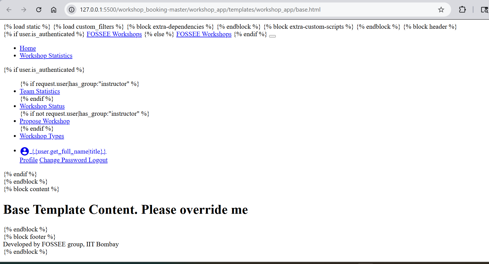
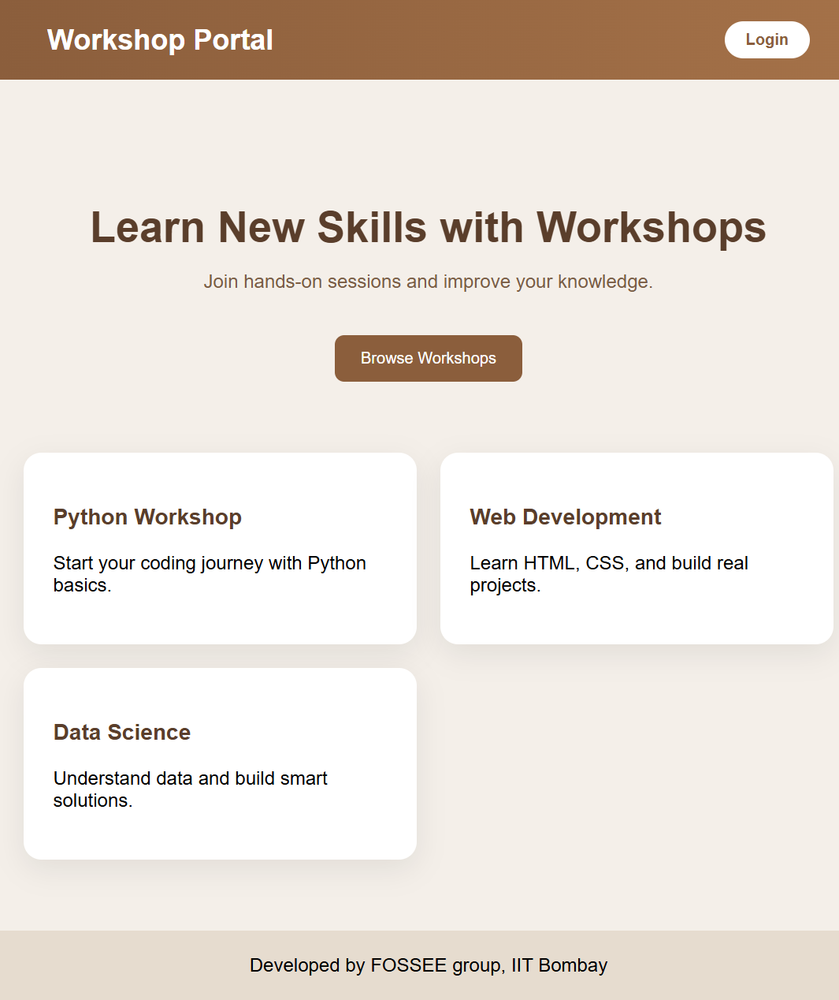

# **Workshop Booking**

> This website is for coordinators to book a workshop(s), they can book a workshop based on instructors posts or can propose a workshop date based on their convenience.

# UI/UX Enhancement - Workshop Portal

## Overview
The original website had a very basic interface and felt quite plain to use. My aim was to improve the overall look and make it more user-friendly while keeping the existing structure unchanged.

## Design Improvements
I tried improving the layout by introducing  simple card based structure to improve readability. I also introduced a consistent light brown theme to make the interface look cleaner. The navigation bar was simplified to make it easier to understand and use.

## Responsiveness
I kept the layout simple so that it works reasonably well on smaller screens. Spacing and alignment were adjusted to improve readability.

## Trade-offs
Instead of using additional frameworks, I focused on basic CSS styling to keep the design lightweight and fast.

## Challenges
One challenge was improving the UI without modifying backend functionality. I mainly focused on improving the frontend layout and styling without changing existing logic.

## Screenshots

### Before UI

### After UI

